# FairDeal Architecture Document

## Document Information

**Project:** FairDeal - AI-Powered Contract Analysis Platform  
**Version:** 1.0  
**Date:** January 2025  
**Team:** Final Year Project  
**Architecture Type:** Monolithic Architecture with Modular Design

---

## Table of Contents

1. [Architecture Selection](#1-architecture-selection)
2. [Architecture Overview](#2-architecture-overview)
3. [Use Case Diagrams](#3-use-case-diagrams)
4. [Class Diagrams](#4-class-diagrams)
5. [Data Flow Diagrams (DFD)](#5-data-flow-diagrams-dfd)
6. [Component Diagrams](#6-component-diagrams)
7. [Sequence Diagrams](#7-sequence-diagrams)
8. [Deployment Diagrams](#8-deployment-diagrams)
9. [Architecture Justification](#9-architecture-justification)

---

## 1. Architecture Selection

### Selected Architecture: **Monolithic Architecture with Modular Design**

FairDeal employs a **Monolithic Architecture** with clear internal modularization. This architecture choice is justified by the following factors:

#### Why Monolithic?

1. **Single Deployment Unit**: The entire backend is deployed as one cohesive application, simplifying deployment and operations.

2. **Shared Data Access**: All modules share the same database connections (SQLite/PostgreSQL and ChromaDB), enabling efficient data access without network overhead.

3. **Development Simplicity**: For a small to medium-sized team, a monolithic architecture reduces complexity in development, testing, and debugging.

4. **Performance**: Direct in-memory function calls between modules eliminate network latency that would exist in microservices.

5. **Transaction Management**: ACID transactions across multiple database operations are straightforward in a monolithic system.

#### Modular Design Principles

While monolithic, the system is organized into clear modules:

- **API Layer**: FastAPI routes and request handling
- **Service Layer**: Business logic (analysis, extraction, statistics)
- **Data Layer**: Database access and persistence
- **Parser Layer**: Document parsing and OCR
- **LLM Integration Layer**: External AI service integration

This modular structure allows for future migration to microservices if needed, while maintaining simplicity for the current scale.

---

## 2. Architecture Overview

### High-Level Architecture

```
┌─────────────────────────────────────────────────────────────┐
│                    FairDeal Backend                         │
│                  (Monolithic Application)                    │
├─────────────────────────────────────────────────────────────┤
│                                                              │
│  ┌──────────────┐  ┌──────────────┐  ┌──────────────┐    │
│  │   API Layer  │  │ Service Layer│  │  Data Layer  │    │
│  │              │  │              │  │              │    │
│  │ - Auth API   │  │ - Analysis   │  │ - SQLAlchemy │    │
│  │ - Contract   │  │ - Extraction │  │ - ChromaDB   │    │
│  │   API        │  │ - Statistics │  │ - File I/O    │    │
│  │ - Profile    │  │ - RAG        │  │              │    │
│  │   API        │  │ - Chatbot    │  │              │    │
│  │ - Debug API  │  │              │  │              │    │
│  └──────────────┘  └──────────────┘  └──────────────┘    │
│                                                              │
│  ┌──────────────┐  ┌──────────────┐                       │
│  │ Parser Layer │  │ LLM Layer    │                       │
│  │              │  │              │                       │
│  │ - PDF        │  │ - Gemini API │                       │
│  │ - DOCX       │  │ - Embeddings │                       │
│  │ - OCR        │  │              │                       │
│  └──────────────┘  └──────────────┘                       │
│                                                              │
└─────────────────────────────────────────────────────────────┘
         │                    │                    │
         ▼                    ▼                    ▼
    ┌─────────┐         ┌─────────┐         ┌─────────┐
    │PostgreSQL│         │ ChromaDB│         │File System│
    │/ SQLite  │         │(Vectors) │         │(Contracts)│
    └─────────┘         └─────────┘         └─────────┘
```

### Architecture Layers

#### 1. **Presentation Layer (API)**
- FastAPI REST endpoints
- Request validation and authentication
- Response serialization
- Error handling

#### 2. **Business Logic Layer (Services)**
- Contract analysis orchestration
- Metadata extraction
- Statistical computation
- RAG retrieval
- Chatbot logic

#### 3. **Data Access Layer**
- Database ORM (SQLAlchemy)
- Vector database client (ChromaDB)
- File system operations
- Caching (if implemented)

#### 4. **Integration Layer**
- LLM API clients
- External service adapters
- Rate limiting and retry logic

---

## 3. Use Case Diagrams

### 3.1 System Use Case Diagram

```mermaid
graph TB
    User[User]
    Admin[Administrator]
    System[FairDeal System]
    
    User -->|Register/Login| Auth[Authentication]
    User -->|Upload Contract| Upload[Upload Contract]
    User -->|View Analysis| Analysis[View Analysis Results]
    User -->|Chat with AI| Chat[AI Chatbot]
    User -->|View Profile| Profile[View Profile & History]
    
    Admin -->|Ingest Contracts| Ingest[Ingest Contracts to KB]
    Admin -->|Monitor System| Monitor[System Monitoring]
    
    System -->|Extract Text| Extract[Text Extraction]
    System -->|Analyze Contract| Analyze[Contract Analysis]
    System -->|Compare Market| Compare[Market Comparison]
    System -->|Generate Report| Report[Generate Report]
    
    style User fill:#e1f5ff
    style Admin fill:#fff4e1
    style System fill:#e8f5e9
```

### 3.2 Contract Analysis Use Case

```mermaid
graph LR
    User[User] -->|1. Upload| Upload[Upload Contract File]
    Upload -->|2. Parse| Parse[Parse Document]
    Parse -->|3. Extract| Extract[Extract Metadata]
    Extract -->|4. Compare| Compare[Compare with Market]
    Compare -->|5. Score| Score[Calculate Fairness Score]
    Score -->|6. Generate| Generate[Generate Insights]
    Generate -->|7. Display| Display[Display Results]
    
    style User fill:#e1f5ff
    style Display fill:#c8e6c9
```

### 3.3 Administrator Use Cases

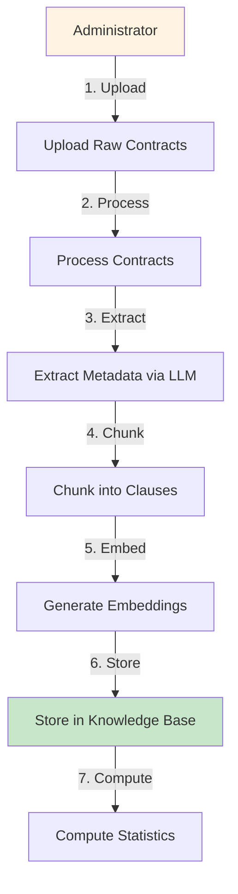

---

## 4. Class Diagrams

### 4.1 Core Domain Classes

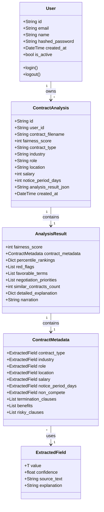

### 4.2 Service Layer Classes

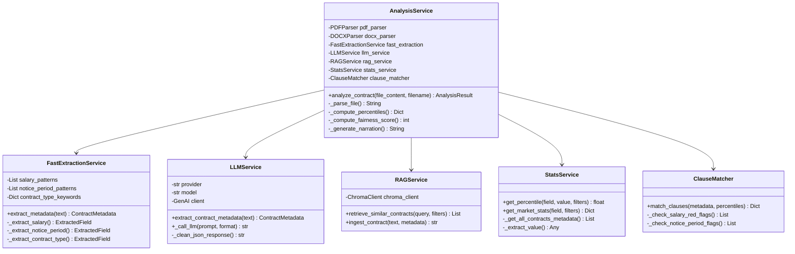

### 4.3 Data Access Layer Classes

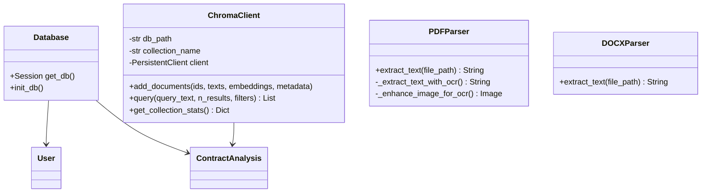

---

## 5. Data Flow Diagrams (DFD)

### 5.1 Level 0 DFD (Context Diagram)

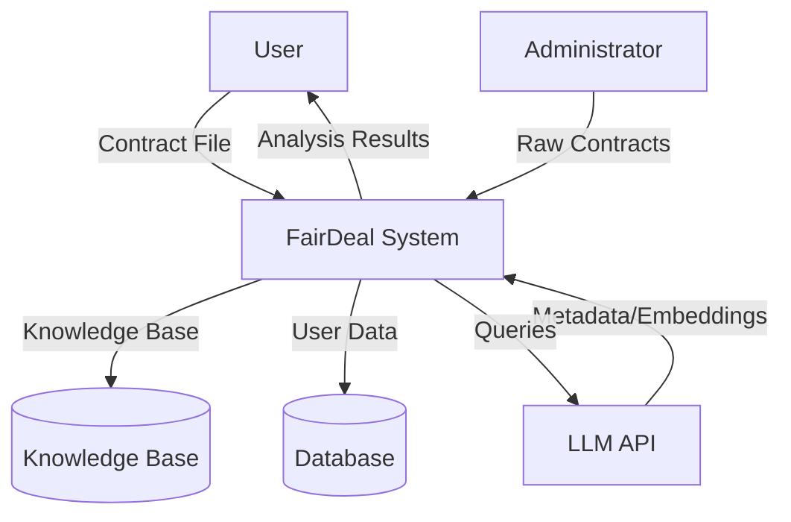

### 5.2 Level 1 DFD (System Decomposition)

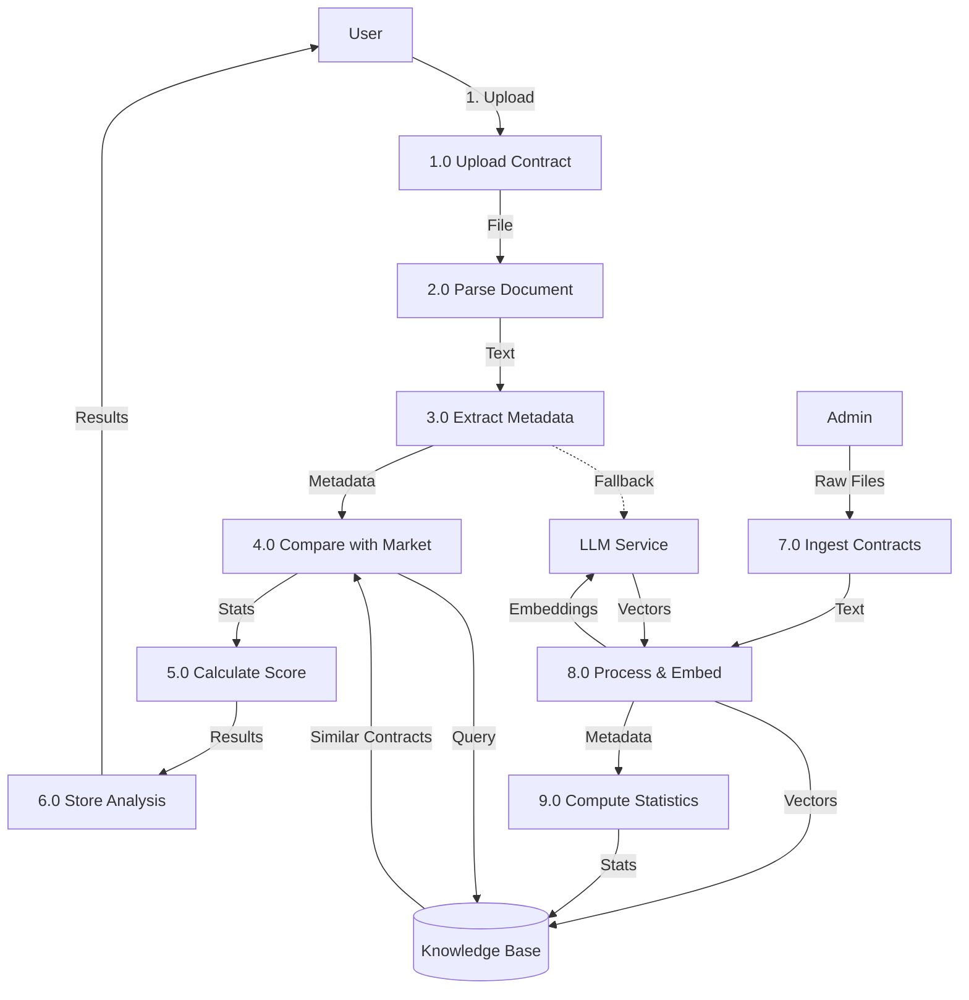

### 5.3 Level 2 DFD (Contract Analysis Process)

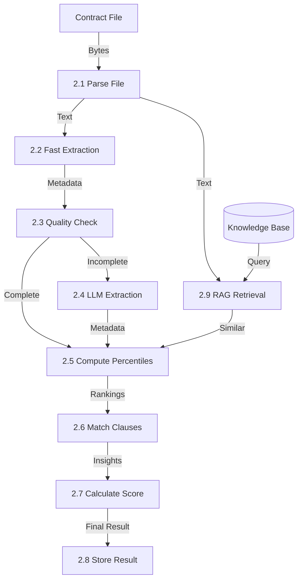

---

## 6. Component Diagrams

### 6.1 System Components

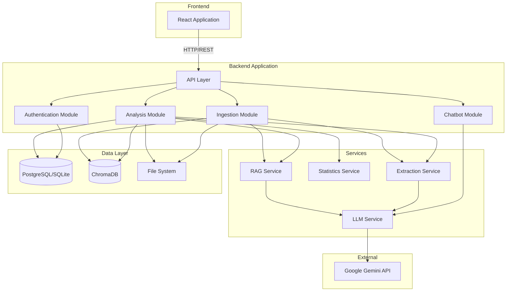

### 6.2 Module Dependencies

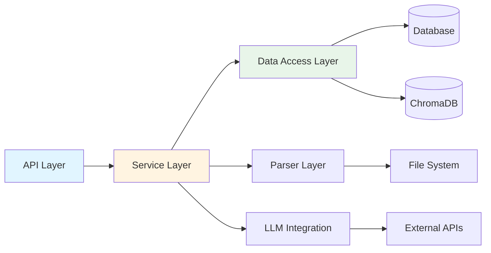

---

## 7. Sequence Diagrams

### 7.1 Contract Analysis Sequence

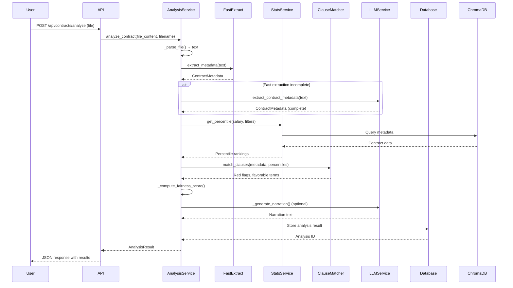

### 7.2 Contract Ingestion Sequence

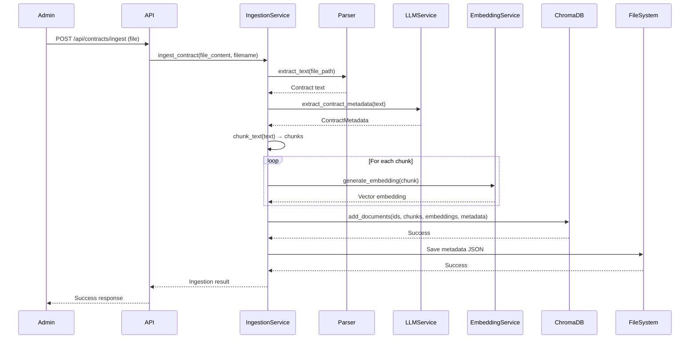

### 7.3 User Authentication Sequence

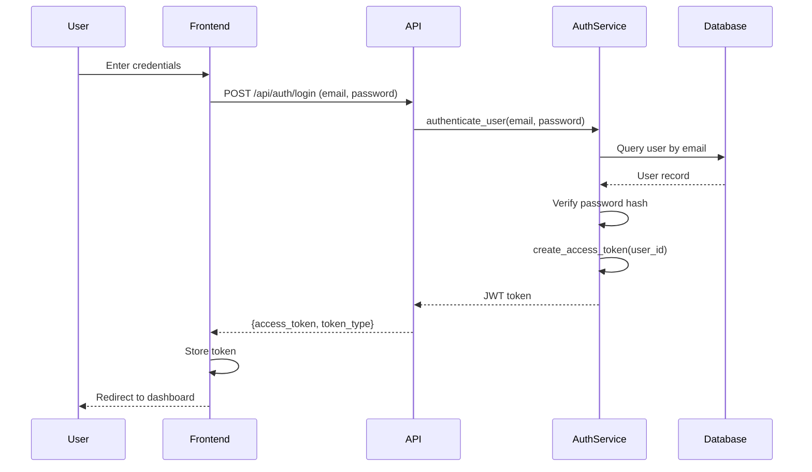

### 7.4 RAG Retrieval Sequence

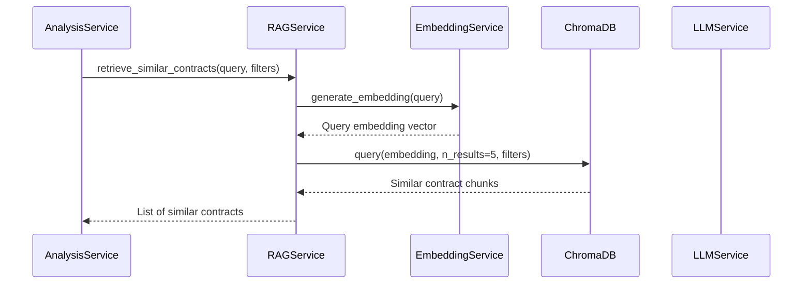

---

## 8. Deployment Diagrams

### 8.1 System Deployment Architecture

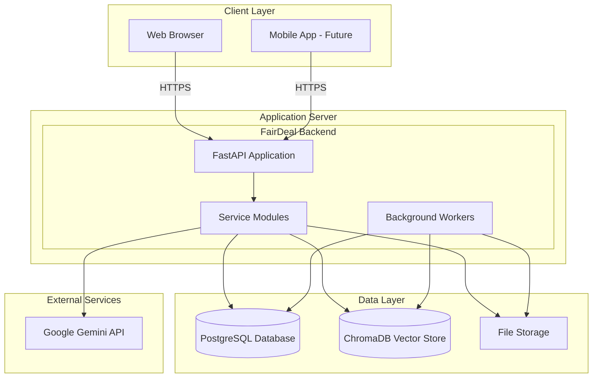

### 8.2 Production Deployment

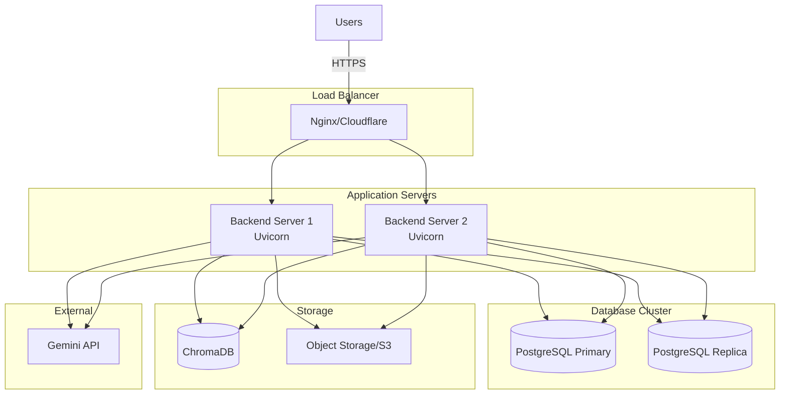

### 8.3 Development Deployment

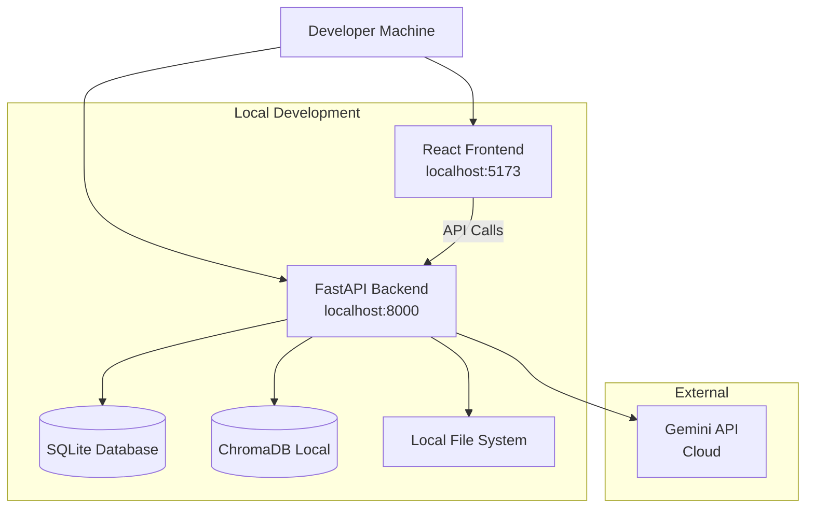

---

## 9. Architecture Justification

### 9.1 Why Monolithic Architecture?

#### Advantages for FairDeal

1. **Simplicity**
   - Single codebase reduces complexity
   - Easier to understand and maintain
   - Faster development cycles
   - Simplified testing and debugging

2. **Performance**
   - No network overhead between modules
   - Direct function calls are faster than HTTP/RPC
   - Shared memory for caching
   - Efficient database connection pooling

3. **Transaction Management**
   - ACID transactions across multiple operations
   - Consistent data state
   - Easier rollback on errors

4. **Deployment**
   - Single deployment unit
   - Easier versioning and rollback
   - Reduced operational complexity

5. **Resource Efficiency**
   - Lower memory footprint
   - No service mesh overhead
   - Efficient resource utilization

#### When to Consider Microservices

FairDeal would benefit from microservices if:
- Team size grows beyond 10 developers
- Different modules need independent scaling
- Different deployment schedules are required
- Polyglot programming is needed
- Fault isolation becomes critical

Currently, these conditions are not met, making monolithic architecture the optimal choice.

### 9.2 Modular Design Benefits

While monolithic, the system maintains clear module boundaries:

1. **API Layer**: Isolated from business logic
2. **Service Layer**: Reusable business logic
3. **Data Layer**: Abstracted database access
4. **Integration Layer**: External service adapters

This modularity enables:
- Future migration to microservices if needed
- Independent testing of modules
- Clear separation of concerns
- Easier code maintenance

### 9.3 Comparison with Other Architectures

#### Monolithic vs. Microservices

| Aspect | Monolithic (FairDeal) | Microservices |
|--------|----------------------|---------------|
| **Complexity** | Low | High |
| **Deployment** | Single unit | Multiple services |
| **Scaling** | Vertical | Horizontal (per service) |
| **Latency** | Low (in-process) | Higher (network) |
| **Team Size** | Small-medium | Large |
| **Current Fit** | ✅ Optimal | ❌ Over-engineered |

#### Monolithic vs. Serverless

| Aspect | Monolithic (FairDeal) | Serverless |
|--------|----------------------|------------|
| **Cold Starts** | None | Possible |
| **State Management** | In-memory | Stateless |
| **Long-Running Tasks** | Supported | Limited |
| **Cost** | Predictable | Pay-per-use |
| **Current Fit** | ✅ Optimal | ❌ Not suitable |

#### Monolithic vs. Event-Driven

| Aspect | Monolithic (FairDeal) | Event-Driven |
|--------|----------------------|--------------|
| **Coupling** | Tight | Loose |
| **Complexity** | Low | High |
| **Real-time** | Request-response | Async events |
| **Current Fit** | ✅ Optimal | ❌ Unnecessary |

### 9.4 Future Evolution Path

The current monolithic architecture can evolve:

**Phase 1 (Current)**: Monolithic with modules
- Single deployment
- Clear module boundaries
- Shared database

**Phase 2 (If Needed)**: Modular Monolith
- Separate modules with clear interfaces
- Still single deployment
- Easier to extract services later

**Phase 3 (If Scale Demands)**: Microservices
- Extract ingestion service (offline processing)
- Extract analysis service (runtime processing)
- Extract chatbot service (optional LLM)
- Shared data layer via APIs

The current architecture supports this evolution without requiring a complete rewrite.

---

## 10. Architecture Patterns Used

### 10.1 Layered Architecture

The system follows a layered architecture pattern:

```
┌─────────────────────┐
│   Presentation      │  API Layer
├─────────────────────┤
│   Business Logic    │  Service Layer
├─────────────────────┤
│   Data Access       │  Data Layer
├─────────────────────┤
│   Infrastructure    │  External Services
└─────────────────────┘
```

### 10.2 Service-Oriented Architecture (Internal)

While monolithic, the system uses service-oriented principles internally:

- **AnalysisService**: Orchestrates contract analysis
- **ExtractionService**: Handles metadata extraction
- **StatsService**: Computes statistics
- **RAGService**: Manages vector retrieval
- **ChatbotService**: Handles AI conversations

Each service has a single responsibility and clear interface.

### 10.3 Repository Pattern

Data access follows the repository pattern:

- **Database**: SQLAlchemy ORM abstracts database access
- **ChromaDB**: ChromaClient abstracts vector database
- **File System**: Parser classes abstract file operations

This enables:
- Easy testing (mock repositories)
- Database-agnostic code
- Clear data access boundaries

### 10.4 Strategy Pattern

The system uses strategy pattern for:

- **Extraction Strategy**: Fast extraction vs. LLM extraction
- **Parser Strategy**: PDF parser vs. DOCX parser
- **LLM Strategy**: Different LLM providers (currently Gemini)

This allows runtime selection of strategies based on context.

---

## 11. Non-Functional Requirements

### 11.1 Performance

- **Response Time**: < 4 seconds for contract analysis
- **Throughput**: 10+ concurrent analyses
- **Scalability**: Vertical scaling (add CPU/RAM)

### 11.2 Reliability

- **Availability**: 99% uptime target
- **Fault Tolerance**: Graceful degradation if LLM unavailable
- **Error Handling**: Comprehensive error messages

### 11.3 Security

- **Authentication**: JWT-based authentication
- **Authorization**: User-scoped data access
- **Data Protection**: Encrypted passwords, secure file storage

### 11.4 Maintainability

- **Code Organization**: Clear module structure
- **Documentation**: Comprehensive inline and external docs
- **Testing**: Unit tests for critical paths

---

## 12. Conclusion

FairDeal employs a **Monolithic Architecture with Modular Design** that provides:

1. **Simplicity**: Easy to develop, test, and deploy
2. **Performance**: Fast in-process communication
3. **Maintainability**: Clear module boundaries
4. **Scalability**: Can evolve to microservices if needed
5. **Cost-Effectiveness**: Lower operational overhead

This architecture choice is optimal for the current scale and requirements, while providing a clear path for future evolution if needed.

---

## Appendix: Diagram Tools

All diagrams in this document are created using:
- **Mermaid.js**: For flowcharts, sequence diagrams, class diagrams
- **ASCII Art**: For simple structural diagrams
- **Standard UML**: Following UML 2.5 specifications

Diagrams can be rendered in:
- GitHub/GitLab (native Mermaid support)
- Markdown viewers with Mermaid plugin
- Documentation tools (Docusaurus, MkDocs)
- Online Mermaid editors

---

**Document End**

